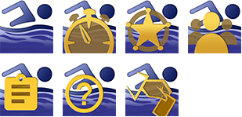
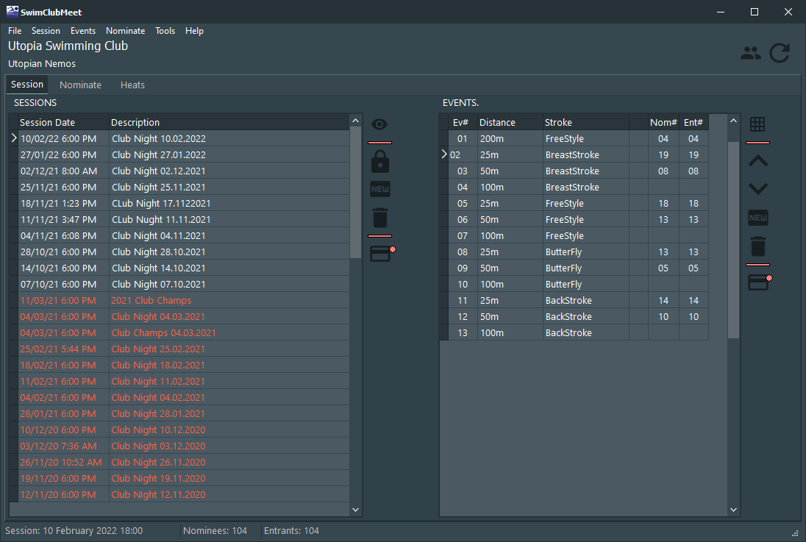
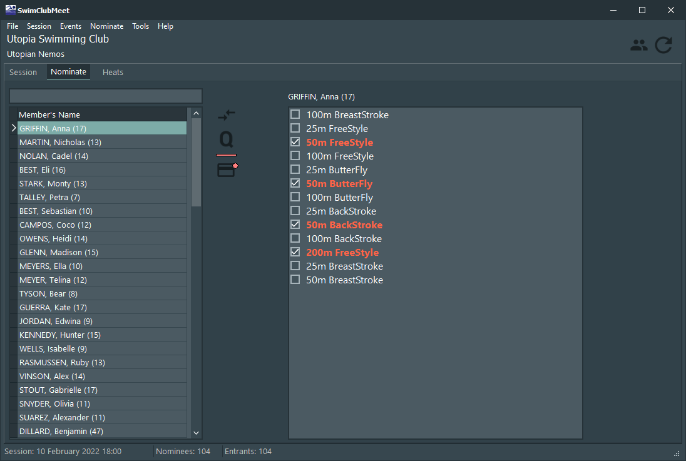
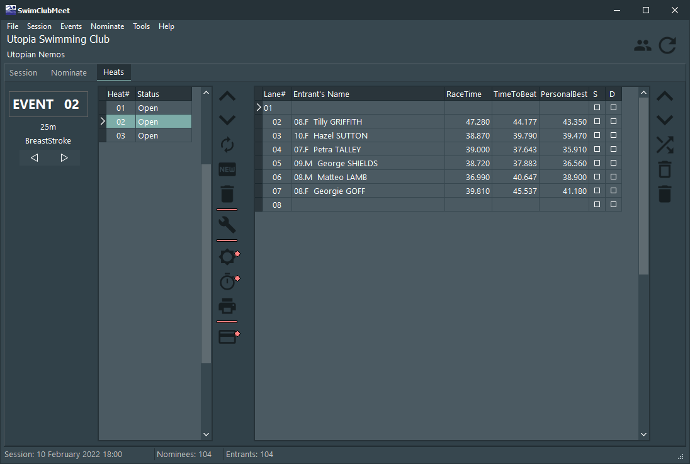

# SCM_SwimClubMeet RELEASE

### SwimClubMeet.exe (SCM) is an application that manages you members and runs your club-nights.

---
SCM is a 32bit application written in C++ It's part of an eco system of applications that make up the SwimClubMeet project. 

To get started all you need is a laptop and printer.

SCM lets amateur swimming clubs store member data, create sessions, events, nominate members to events, auto-build heats (and manually), print marshal and timekeeper sheets, record race-times and create session reports. (Currently, over 20 reports can be printed.) And much more.

With the addition of Wi-Fi and Marshal and TimeKeeper support applications, you can run paperless.

Fix nomination bottle neck by adding more PC's or use the Nominate application for members to self nominate.

SCM uses MS SQLEXPRESS. You have full ownership of your data. Use the SCM_BuildMeAClub utility to create your SwimClubMeet database in SQLEXPRESS.

Included in the install is **Help for SCM**. It has a handy **Getting Started** section.

To learn more about SCM view the [github pages](https://artanemus.github.io/index.html).

If you are interested in following a developer's blog and track my progress then you can find me at [ko-fi](https://ko-fi.com/artanemus).

---

### CODE

As of version 1.5.5.0, SCM is written in Delphi using Embarcadero's RAD Studio 11.2. FastReport VCL components are used for reporting. Database access is done with FireDAC (included in the enterprise edition). Other than that, no other additional VCL components have been used. All SQL scripts have been written to be compatible with MS SQL EXPRESS 2017 and up. The release version is 32bit due to the limits of FastReport.

24/03/2023 : To compile this project you must also clone the Artanemus/SCM_SHARED repo.

FYI: Database design was done with ERStudio.

### USING SCM

After install, by default, an icon is placed on the desktop. If you elect to disabled this, type **swim** in the windows search bar to discover it. Else navigate to the **Artanemus** folder on the start bar. (All SCM applications and utilities are located in this folder.)

### ON START-UP

The application will ask you to login to the database. It's suggested that you first enter your members into SCM. Use the **Help for SCM** manual for the next steps.

> Use Windows **Apps and Features** to remove the application.

---

